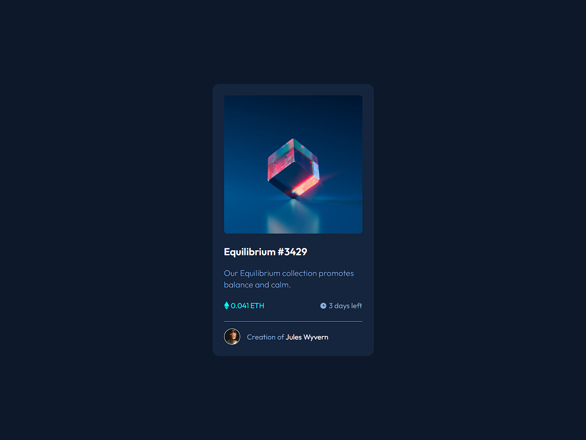

# Frontend Mentor - NFT preview card component solution

This is a solution to the [NFT preview card component challenge on Frontend Mentor](https://www.frontendmentor.io/challenges/nft-preview-card-component-SbdUL_w0U). Frontend Mentor challenges help you improve your coding skills by building realistic projects. 

## Table of contents

- [Overview](#overview)
  - [The challenge](#the-challenge)
  - [Screenshot](#screenshot)
  - [Links](#links)
- [My process](#my-process)
  - [Built with](#built-with)
  - [What I learned](#what-i-learned)
  - [Continued development](#continued-development)
- [Author](#author)

### The challenge

Make an NFT View Card Component

### Screenshot




### Links

- Solution URL: [Add solution URL here](https://your-solution-url.com)
- Live Site URL: [Add live site URL here](https://your-live-site-url.com)

## My process

### Built with

- Semantic HTML5 markup
- CSS custom properties
- Flexbox
- CSS Grid
- [Styled Components](https://styled-components.com/) - For styles


### What I learned

I learned how to use divs and organize the information and images I added correctly and in order.
I also learned how to organize the folders and the order of each link: css to add to the HTML.

Some parts of codes that I learned and intend to fix so I don't forget.

How to put variables
```css
:root {
    --primary-soft: hsl(215, 51%, 70%);
    --primary-medium: hsl(178, 100%, 50%);

    --neutral-dark: hsl(217, 54%, 11%);
    --neutral-medium: hsl(216, 50%, 16%);
    --neutral-soft: hsl(215, 32%, 27%);
}
```
Style: Criação de elemento no CSS
```css
after
.nft-card .image-link::after {
    content: '';
    background: url(../images/icon-view.svg) no-repeat center;
    position: absolute;
    width: 100%;
    height: 100%;
    opacity: 0;
    transition: 0.4s ease-in-out;
}

```
```css
before
.nft-card .image-link::before {
    content: '';
    background-color: cyan;
    width: 100%;
    height: 100%;
    position: absolute;
    opacity: 0;
    transition: 0.4s ease-in-out;
}

```


### Continued development

Predicting to focus on the frontend, until I feel confident in doing more complex projects and only then study another technology.


## Author

- Website - [Julio Resende]()
- Frontend Mentor - [@yourusername](https://www.frontendmentor.io/profile/julioresende77)
- Twitter - [@yourusername](https://www.twitter.com/ResendeDev)